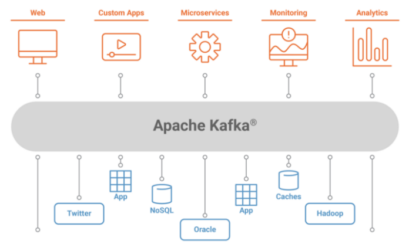
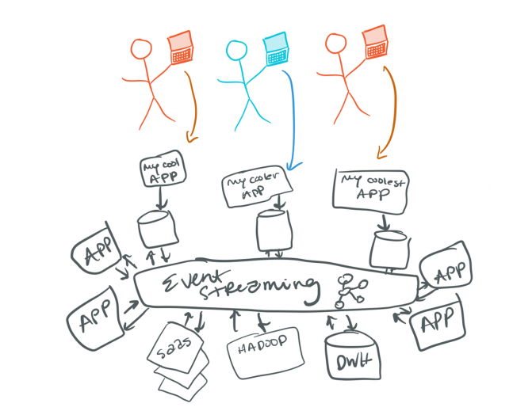
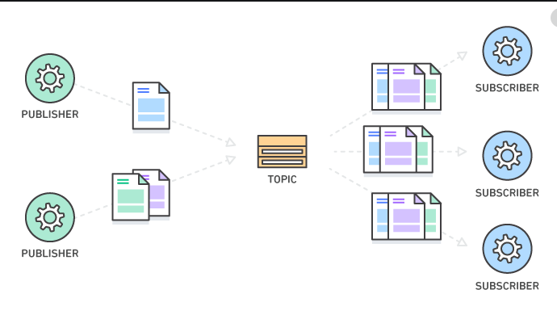
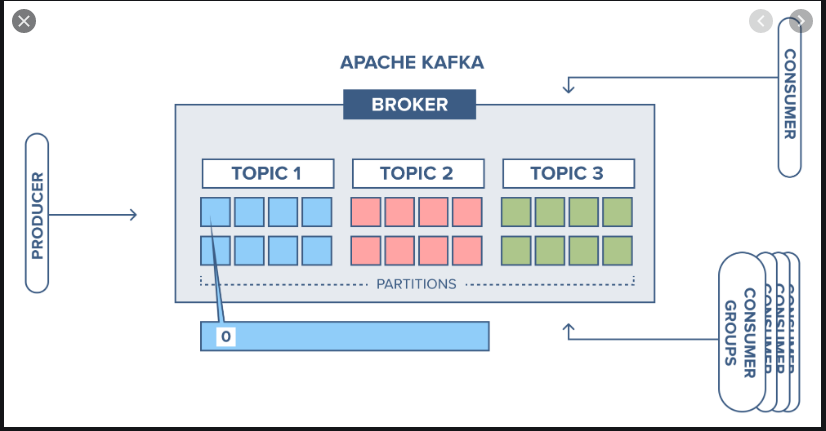
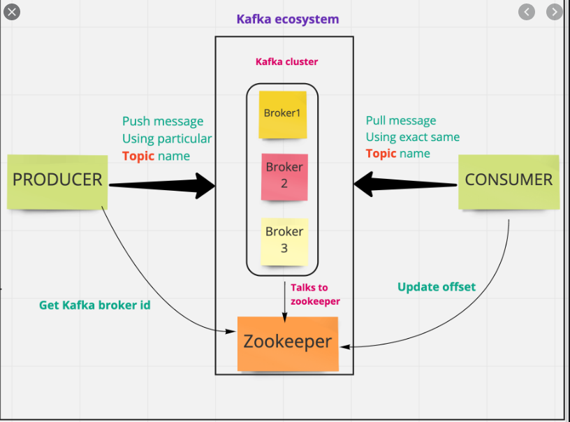

 

In strawman terms, Kafka is a messaging system which can be used across different systems to communicate. In the below image you can see that Kafka acts as a message bus in between web apps, microservices, analytics apps, databases.

<!--more-->

 

 

## We say Kafka is an open-source event stream processing platform.

Kafka stores data in streams of continuous records which can  then be processed by different systems.

 

 

### So what's an event here?

Something happened !!!
What ? -> A change in the state of some data.

Event is a lightweight representation of "something happened".

We have been looking at events perspective for so long in frontend, mouse click event, hover event, and so on, and here we are starting to look through the same glass in a larger field.

We have a general structure for these events:
- What changed? : Key
- What is the change? : Value
- When did the change happen? Timestamp
- Who did the change? User Stamp

The event can then be distributed to those interested on it. They can be any system, like an email notification service for a new follow request on Insta will be interested on a follow request event.

### What's an Event Stream?
A small river is called a stream. I had one on my way to school, so I like to imagine streams in that way, mashup or nature and tech with nostalgia. If you are of the YouTube age, you already know what a stream is.

Moving ahead from PJs, Stream represents a flow of something happening over a period of time, here "data". Data being available to you over a span of time, which doesn’t have a potential limit or any finite value.

An event stream consists of immutable data, where new events are added but previous ones can’t be changed.

### Event Streaming
Event Streaming is the constant flow of events where each event contains enough information to reflect the change in state. It allows the processing of data to occur in real-time (data in motion).

Streaming data is unbounded, meaning it has no real beginning and no real end. They are processed as they occur and are managed accordingly.

Event streaming is used for real-time processing and analysis of state changes.

In Kafka we can persist event streams supporting the rebuilding of the state through replaying events in the order they were received.

## We say Kafka is an open-source DISTRIBUTED event stream processing platform.

Kafka works as a cluster of one or more nodes that can live in different Datacenters.

We can distribute data / load across different nodes in the Kafka Cluster, and it is inherently scalable, available, and fault-tolerant.

Just in case you are unsure of what a distributed system is:

In a distributed system we are slicing off a work into pieces and distributing it across machines.

You have components of a system spread across different machines or even networks.

And a cluster is just a group of nodes (computers/systems), which are dynamic. These nodes can increase or decrease in number as per some constraints or manually.

 

 

### Broker

In the last image, you would have noticed the mention of a Broker. Brokers are nodes in a Kafka cluster running Kafka servers, which are responsible for storing the events.
They allow the push and pull of events from them.

## We say Kafka is an opensource distributed event stream processing platform based on the PUBLISHER-SUBSCRIBER model.

Kafka works in the pub/sub method. Where it allows publishers to push into topics and subscribers to consume from a topic.

 

 

### Topic
Kafka Topics are a bunch of similar events stored together in Kafka Brokers. Kafka records are organized into topics.

Producer applications write data to topics and consumer applications read from topics.

Records published to the cluster stay in the cluster until a configurable retention period has passed by.

 

 

### Publishers
An application that publishes a message to a topic (Generally called channel in pub/sub).
It does not know the destination of the event, but only where it needs to store this event.

Generally you would use the event key to select a topic to store your event into.

### Subscribers / Consumers
An application that registers itself to a topic to receive the events.

It does not know the source of the message.

Consumers label themselves with a consumer group name, and each record published to a topic is delivered to one consumer instance within each subscribing consumer group. Consumer instances can be in separate processes or on separate machines.

 

 

## Kafka is an opensource distributed event stream processing platform based on the pub/sub model which stores events using LOGS.

One of the key elements in Kafka is the usage of the log data structure.

Kafka stores events in the form of Logs in Kafka topics.

 

 

### What are logs?

Not to confuse with application logs or to confuse with it.

A log is perhaps the simplest possible storage abstraction. It is an append-only, totally-ordered sequence of records ordered by time.

Records are appended to the end of the log, and reads proceed left-to-right. Each entry is assigned a unique sequential log entry number.

### What's the zookeeper?
Zookeeper works as the central configuration and consensus management system for Kafka. It tracks the brokers, topics, and partition assignment, leader election, basically all the metadata about the cluster.

ZooKeeper is used to notify producers and consumers about the presence of any new broker in the Kafka system or about the failure of any broker in the Kafka system.

### What are people using it for?

Here's a list directly from the Kafka docs.

- To process payments and financial transactions in real-time, such as in-stock exchanges, banks, and insurances.

- To track and monitor cars, trucks, fleets, and shipments in real-time, such as in logistics and the automotive industry.

- To continuously capture and analyze sensor data from IoT devices or other equipment, such as in factories and wind parks.

- To collect and immediately react to customer interactions and orders, such as in retail, the hotel and travel industry, and mobile applications.

- To monitor patients in hospital care and predict changes in condition to ensure a timely treatment in emergencies.

- To connect, store, and make available data produced by different divisions of a company.

- To serve as the foundation for data platforms, event-driven architectures, and microservices.

## References
Here are a few links this article takes inspiration from.

https://kafka.apache.org/documentation/#gettingStarted
https://dzone.com/articles/a-begineers-approach-to-quotkafkaquot
https://docs.confluent.io/platform/current/kafka/introduction.html
https://robertleggett.blog/2020/03/02/choosing-event-streaming-or-messaging-for-your-architecture/
https://kafka.apache.org/intro
https://www.cloudkarafka.com/blog/2016-11-30-part1-kafka-for-beginners-what-is-apache-kafka.html
https://medium.com/swlh/understanding-kafka-a-distributed-streaming-platform-9a0360b99de8
https://engineering.linkedin.com/distributed-systems/log-what-every-software-engineer-should-know-about-real-time-datas-unifying
