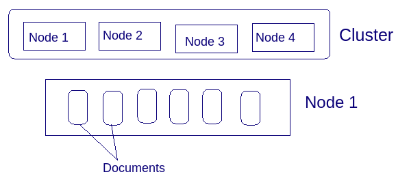
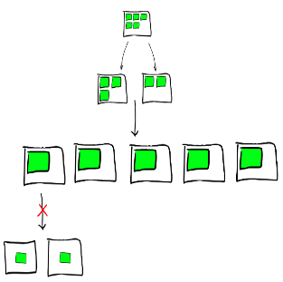
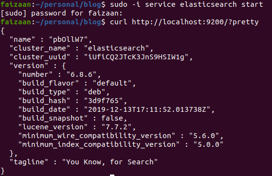
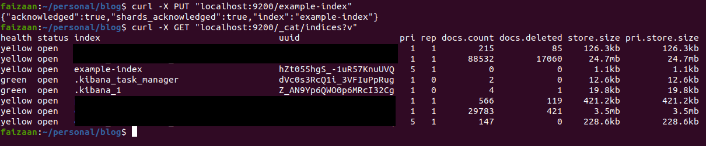
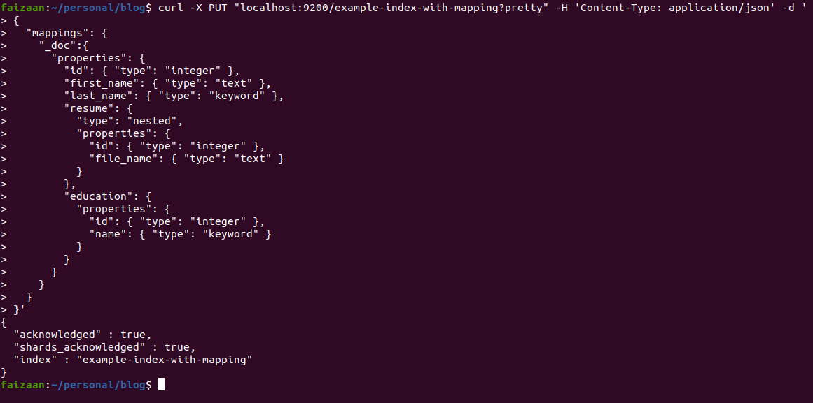

# Getting familiar with Elasticsearch


## Intro
Search has become such an extended part of our daily life. Before starting to write this post, I just searched for my fav indie artist Prateek Kuhad on Spotify, plugged in my headphones and here I am making keystrokes with the flow of Dil Beparwah :slightly_smiling_face:. With a happy mood what I would like to convey is if you are building a web app, you gotta have the search features. So without boring you more let me dive into what this post is about.

If you have a dynamic web app with a good amount of data size which you are looking at handling, and you are planning at adding features for just search or even more with filters, sorts, analytics, having a dedicated search service solves your problem to a great amount. Your databases won't be busy with all the search kind of requests, and you will also provide your users with a huge difference in search result time. A dedicated search engine for an application in the present-day is much of a necessity for most use cases with a large user base or data.

In this post I will take you through the base of elasticsearch and leave you at how we can use it, after that the Journey is all yours :slightly_smiling_face:.

## What is a Document Store?
You must have heard of Document data models at some point of time, or in the DynamoDB post where I talked about NoSql databases a bit. Document data models are non-relational and non-normalized flat datastore where you store your data in the form of keys and values in JSON, XML, YAML and alike formats.

Document store points to a semi-structured data storage solution where we store document data.
And a distributed document store is the one which has document stores across nodes in a cluster.
(if you are unfamiliar with the words nodes and cluster, just understand it like a node is a machine in a network with a lot of machines which is called a cluster)



<br/>

## Lucene
Elasticsearch is built on top of Lucene, thus let us take a moment describing what it is.
Lucene is a powerful, built-for-purpose full-text search library. A full-text search is a technique for search engines where they allow us to search textual content in a document.

Lucene takes a raw stream of characters, bundles them into **tokens**, and persists them as **terms** in an index(assume index as a table of contents, we will come to it very soon). It can quickly query that index and provide the ordered results.

By using Lucene directly in our applications, or as part of a server, we can perform full-text searches in real-time over gigabytes of content. We also get custom analysis and scoring techniques, using which we can improve the relevance of results.

- **Tokens**: Data parsing in Lucene extracts out individual units like words from a raw stream of characters and stores them in indexes, these individual units are called tokens. They are occurrences of these words/units.
- **Terms**: Stored tokens are called terms, and they are unit of search, it consists of the text as a string and the field in the document where it was found.

You can think of this all by thinking of yourself as Lucene, and assume you receive a lot of data from your input senses, one of your senses is the vision, and you are having a constant stream of data received in your mind. While you are moving across your house, and focussing on what's kept at what place, you are processing these data streams, and creating an index of where the phone is, where the spoons are, and where the comb is. Now when you require one of them like the comb, your brain quickly looks up at this index, and lets you know that comb is in your dressing table.

Tokens and terms are simple but really good to understand.

## Inverted Index and Forward Index
An index is like an address book, instead of telling here a person is, it tells you where a data is, and thus helps you to fetch that data quickly. So one can efficiently retrieve records using indexes.

<br/>
Inverted Index is a data structure that stores a mapping from words to their documents. Slow Indexing but Fast Search.

| Words      | Chapters             |
|------------|----------------------|
| Hello      | Chapter 1            |
| Coffee     | Chapter 2, Chapter 3 |
| Greetings  | Chapter 1            |

<br/>
Forward index is a data structure that stores mapping from documents to words. Fast indexing but slow search.

| Chapters  | Words                 |
|-----------|-----------------------|
| Chapter 1 | Hello, mello, kello   |
| Chapter 2 | Tea, Coffee, Biscuits |
| Chapter 3 | Apple, Banana, Coffee |

You can take a moment to see the index tables and think what should have been a better choice for the elasticsearch developers.

## Elasticsearch
Elasticsearch is a Lucene based distributed search and analytics engine.
- Free and open-source distributed inverted index
- Build on top of Apache Lucene
- Cross-platform
- Near real-time
- Indexed data can respond to complex search queries, filters and aggregations
- Is document-based
- Is scalable
- Data in JSON format
- Pluggable API endpoint

### 1. Cluster:
An elasticsearch cluster in general consists of loosely or tightly connected nodes, which together works as one unit. Cluster virtually describes the set of nodes running on it, and it's the most high-level entity, which can be configured.

### 2. Node:
A node is a running instance of elasticsearch which belongs to a cluster.

### 3. Document:
The document is a non-relational data storage format.

### 4. Index:
An index is a logical namespace, it’s like a ‘database’ we use an RDBMS. It has a mapping definition provided at creation time which defines multiple types of data that can be stored in it. They mappings provide all information about the keys of the documents and the expected types for its value.

### 5. Mapping:
A mapping is like a ‘schema definition’ we do in RDBMS. Each index has a mapping, which defines each field data type within the index, plus several index-wide settings. A mapping can either be defined explicitly, or it will be generated automatically when a document is indexed.

### 6. Shard:
At times when an index can’t just be stored in a single node due to hardware challenges, we split it into x set of documents which is called sharding, and the split-up data is called a shard. A shard is an unbreakable entity in Elasticsearch, in the sense that a shard can only stay on one machine (Node). An index which is a group of shards can spread across multiple machines(ES nodes) but shards can not.


<br/>

##  Basic API requests
Elasticsearch by default runs on 9200 port.
So after [installation](https://www.elastic.co/guide/en/elasticsearch/reference/current/deb.html), and starting your elasticsearch service, you can run a curl command on your localhost 9200 where Elasticsearch returns it's running cluster details.

`curl http://localhost:9200/?pretty`


cURL is a command-line tool to transfer data to or from a server. We use it here to make requests to the Elasticsearch server.


This will give you an output like below, mentioning version and other details. Getting an output here means you have an up and running elasticsearch cluster. And we are good to go.


### Creating an Index
As, I said index is like a database, and we can have multiple indices in a cluster. So for storing some data we first need to add an index. An Index should be generally created for a document which is a flat data representation for a set of values, like Employee Index, Users Index, Posts Index. We first plan for what features we require, and as per that we broadly think of what indices we need. As per the data size, we decide whether 2 indices can be merged, to provide us with a more flat structure or whether an index can be broken into different indices if the use cases are as such that they have a separate concern.

For creating an index you can send a put request to elasticsearch, with the index_name(example-index here) in the URL which you would like to create.
```
curl -X PUT "localhost:9200/example-index"
```
To view all the indices we can do a simple get request as
```
curl -X GET "localhost:9200/_cat/indices?v"
```



<br/>

### Creating an Index with a mapping:
Mapping can be auto-assigned by elasticsearch when you add a document, but I would advice to always create your own mapping, which is the definition of what keys will be stored in the document, and what will be there values. Having a consistent type ensures that we know which fields we can sort on, which fields we can filter on and much more.

Below I am creating an index named `example-index-with-mapping` and I am defining some fields.
- **Integer fields**: The field defined as `"id": { "type": "integer" }`, defines id as an integer type field, that is the value which can be stored there is a numeric value.
- **Text field**: `"file_name": { "type": "text" }`, defines that the field file_name is of a text datatype, a text datatype will let you store all kinds and sizes of textual data, the size limits are huge and you can actually store megabytes of data in text fields, and they will be searchable too.
- **Keyword field**: `"name": { "type": "keyword" }`, defines a keyword field name, keyword fields are also string, but they are for small contents on which you would perform a sort, or a filter. Like when you want to filter all students with a Bachelor in Engineering education background. Examples of fields you may want to set as a Keyword can be emails, education, city, country, hostnames, tags etc.
- **Nested field**: `"resume": { "type": "nested", "properties": { "id": { "type": "integer" }, "file_name": { "type": "text" } } },`, defines a nested field resume, a nested field is one which defines another document inside it. Here resume is defined as a nested document, with id and file_name as it's fields. A nested field is an array of documents inside the document.
- **Object field** `"education": { "properties": { "id": { "type": "integer" }, "name": { "type": "keyword" } } }`, defines education as an Object datatype, note that the way education is defined is so similar to the nested field, the only difference is that we haven't mentioned type nested. An object field is used to attach a single document to a document. Inner objects are called object fields. They are not a set of documents like a nested field. In other words, the Nested field represents an array of objects and the object field represents a single object.

Other important field types include date and booleans. [See here for reading about all data types](https://www.elastic.co/guide/en/elasticsearch/reference/6.8/mapping-types.html)


curl -X PUT "localhost:9200/example-index-with-mapping?pretty" -H 'Content-Type: application/json' -d '
{
  "mappings": {
    "_doc":{
      "properties": {
        "id": { "type": "integer" },
        "first_name": { "type": "text" },
        "last_name": { "type": "keyword" },
        "resume": {
          "type": "nested",
          "properties": {
            "id": { "type": "integer" },
            "file_name": { "type": "text" }
          }
        },
        "education": {
          "properties": {
            "id": { "type": "integer" },
            "name": { "type": "keyword" }
          }
        }
      }
    }
  }
}'


<br/>



<br/>

### Indexing a Document / Adding a document to the Index
Now when we have a mapping set and an index created, we can add some documents. In the URL in the code below you will see the index name `example-index-with-mapping` and type `_doc` (note: types are deprecated, I have used it in the doc since I had an ES version 6 running, you can remove all it's occurrences if you are using version 7 or later and rest will be good), after the type you see `/1`, this is the id which I want to create a document at. Yes we need to provide id in the URL, and ES will either create a document or update it depending on whether the id is existing or not.

You can notice that we send a simple object containing the details of whichever field we want to add, there is no compulsion that we send values for all fields which we defined in the mapping.

```bash
curl -X PUT "localhost:9200/example-index-with-mapping/_doc/1?pretty" -H 'Content-Type: application/json' -d '
{
  "education": [
    {"id":"1","name":"BTech"},
    {"id":"2","name":"HS"}
  ],
  "first_name": "Rahul",
  "last_name":"Shah"
}'
```
<br/>


<br/>

### Searching our document

Searching for a text in the index is about writing queries, here I have a basic match query which aims to find documents where the last_name field has the word "Shah". You can see in the output we get back the document which has that last_name.

```bash
curl -X GET "localhost:9200/example-index-with-mapping/_search?pretty" -H\
'Content-Type: application/json' -d ' {
  "query": {
    "match": {
      "last_name": {
        "query": "Shah"
      }
    }
  }
}'
```
<br/>


<br/>

## Final Words

In the post I have fairly touched a few important concepts which are required in working with Elasticsearch. In real life we don't send raw requests to elasticsearch service as shown above, we use elasticsearch SDK, and doing things becomes much more simpler than above. There are much more to elasticsearch, from queries to aggregations to custom techniques of indexing data. I find the [elasticsearch documentation](https://www.elastic.co/guide/en/elasticsearch/reference/6.8/search.html) very descriptive, so I won't be looking at writing posts on queries as such. But I will try to write some on simplifying your queries and customizing indexes and working with scripts etc, until then adios amigos.

<br/>
